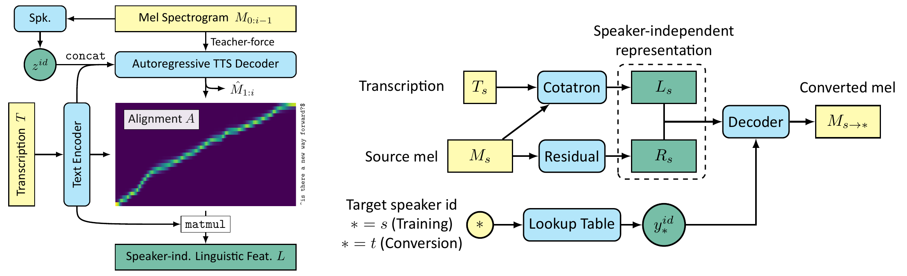

# Cotatron &mdash; Official PyTorch Implementation



**Cotatron: Transcription-Guided Speech Encoder for Any-to-Many Voice Conversion without Parallel Data**<br>
Seung-won Park, Doo-young Kim, Myun-chul Joe @ SNU, [MINDsLab Inc.](https://mindslab.ai)

Paper: https://arxiv.org/abs/2005.03295 (To appear in INTERSPEECH 2020)<br>
Audio Samples: https://mindslab-ai.github.io/cotatron<br>

**Update: Enjoy our pre-trained model with [Google Colab notebook](https://colab.research.google.com/drive/1L1sOs21l6CeU1Zavd5VMHGjo-aUUUGFp?usp=sharing)!**

Abstract: *We propose Cotatron, a transcription-guided speech encoder for speaker-independent linguistic representation. Cotatron is based on the multispeaker TTS architecture and can be trained with conventional TTS datasets. We train a voice conversion system to reconstruct speech with Cotatron features, which is similar to the previous methods based on Phonetic Posteriorgram (PPG). By training and evaluating our system with 108 speakers from the VCTK dataset, we outperform the previous method in terms of both naturalness and speaker similarity. Our system can also convert speech from speakers that are unseen during training, and utilize ASR to automate the transcription with minimal reduction of the performance. Audio samples are available at https://mindslab-ai.github.io/cotatron, and the code with a pre-trained model will be made available soon.*


## Requirements

This repository was tested with following environment:

- Python 3.6.8
- [PyTorch](https://pytorch.org/) 1.4.0
- [PyTorch Lightning](https://github.com/PytorchLightning/pytorch-lightning) 0.7.1

The requirements are highlighted in [requirements.txt](./requirements.txt).

## Datasets

### Preparing Data

- To reproduce the results from our paper, you need to download:
  - LibriTTS train-clean-100 split [tar.gz link](http://www.openslr.org/resources/60/train-clean-100.tar.gz)
  - VCTK Corpus [tar.gz link](http://homepages.inf.ed.ac.uk/jyamagis/release/VCTK-Corpus.tar.gz)
- Unzip each files.
- Resample them into 22.05kHz using `datasets/resample_delete.sh`.

Note: The mel-spectrograms calculated from audio file will be saved as `**.pt` at first, and then loaded from disk afterwards.

### Preparing Metadata

Following a format from [NVIDIA/tacotron2](https://github.com/NVIDIA/tacotron2), the metadata should be formatted like:
```
path_to_wav|transcription|speaker_id
path_to_wav|transcription|speaker_id
...
```
Metadata for LibriTTS train-clean-100 split and VCTK corpus are already prepared at `datasets/metadata`.
If you wish to use a custom data, you need to make the metadata as shown above.


## Training

Training our VC system is consisted of two steps: (1) training Cotatron, (2) training VC decoder on top of Cotatron.

```bash
git clone https://github.com/mindslab-ai/cotatron
cd cotatron
```

There are three `yaml` files in the `config` folder, which are configuration template for each model.
They **must** be edited to match your training requirements (dataset, metadata, etc.).

```bash
cp config/global/default.yaml config/global/config.yaml
cp config/cota/default.yaml config/cota/config.yaml
cp config/vc/default.yaml config/vc/config.yaml
```

Here, all files with name other than `default.yaml` will be ignored from git (see `.gitignore`).

- `config/global`: Global configs that are both used for training Cotatron & VC decoder.
  - Fill in the blanks of: `speakers`, `train_dir`, `train_meta`, `val_dir`, `val_meta`.
  - Example of speaker id list is shown in `datasets/metadata/libritts_vctk_speaker_list.txt`.
  - When replicating the two-stage training process from our paper (training with LibriTTS and then LibriTTS+VCTK), please put both list of speaker ids from LibriTTS and VCTK at global config.
- `config/cota`: Configs for training Cotatron.
  - You may want to change: `batch_size` for GPUs other than 32GB V100, or change `chkpt_dir` to save checkpoints in other disk.
- `config/vc`: Configs for training VC decoder.
  - Fill in the blank of: `cotatron_path`. 

### 1. Training Cotatron

To train the Cotatron, run this command:

```bash
python cotatron_trainer.py -c <path_to_global_config_yaml> <path_to_cotatron_config_yaml> \
                           -g <gpus> -n <run_name>
```

Here are some example commands that might help you understand the arguments:

```bash
# train from scratch with name "my_runname"
python cotatron_trainer.py -c config/global/config.yaml config/cota/config.yaml \
                           -g 0 -n my_runname
```

Optionally, you can resume the training from previously saved checkpoint by adding `-p <checkpoint_path>` argument.

### 2. Training VC decoder

After the Cotatron is sufficiently trained (i.e., producing stable alignment + converged loss),
the VC decoder can be trained on top of it.

```bash
python synthesizer_trainer.py -c <path_to_global_config_yaml> <path_to_vc_config_yaml> \
                              -g <gpus> -n <run_name>
```

The optional checkpoint argument is also available for VC decoder.

### Monitoring via Tensorboard

The progress of training with loss values and validation output can be monitored with tensorboard.
By default, the logs will be stored at `logs/cota` or `logs/vc`, which can be modified by editing `log.log_dir` parameter at config yaml file.

```bash
tensorboard --log_dir logs/cota --bind_all # Cotatron - Scalars, Images, Hparams, Projector will be shown.
tensorboard --log_dir logs/vc --bind_all # VC decoder - Scalars, Images, Hparams will be shown.
```

## Inference

We provide a Jupyter Notebook script to provide the code for inference and show some visualizations with resulting audio.
- https://colab.research.google.com/drive/1L1sOs21l6CeU1Zavd5VMHGjo-aUUUGFp?usp=sharing
This notebook provides pre-trained weights for Cotatron-based VC system and MelGAN vocoder.

## Results

According to the user study done in MTurk, our Cotatron-based VC system performs significantly better than previous method in terms of both naturalness (MOS) and speaker similarity (DMOS).
The objective results on speaker similarity (SCA) contradicts that from subjective results. See section 4.1 from our paper for details.

| Approach                             | MOS         | DMOS        | SCA   |
|--------------------------------------|-------------|-------------|-------|
| Source as Target                     | 4.28 ± 0.11 | 1.71 ± 0.22 | 0.9%  |
| Target as Target                     | 4.28 ± 0.11 | 4.78 ± 0.08 | 99.4% |
| Blow (previous method)               | 2.41 ± 0.14 | 1.95 ± 0.16 | **86.8%** |
| Cotatron w/o residual encoder (Ours) | 3.18 ± 0.14 | **4.06 ± 0.17** | 73.3% |
| Cotatron w/ residual encoder (Ours)  | **3.41 ± 0.14** | 3.89 ± 0.18 | 78.5% |

## Implementation details

Here are some noteworthy details of implementation, which could not be included in our paper due to the lack of space:

- Masked padding

Since the length of training samples are not identical, they are zero-padded to match the batch's max length for GPU efficiency. Therefore, the output of every convolutional layer is masked to prevent the results of the padded areas from affecting the non-padded area. Please refer to appendix A.1 of [Binkowski et al. (GAN-TTS, 2020)](https://openreview.net/forum?id=r1gfQgSFDr).

- Padded Instance Normalization

We exclude the padded area from the statistics calculation for the instance normalization layer of the residual encoder. See [modules/padded_instancenorm.py](./modules/padded_instancenorm.py).


## License

BSD 3-Clause License.

## Citation & Contact

```bibtex
@article{park2020cotatron,
  title   = {Cotatron: Transcription-Guided Speech Encoder for Any-to-Many Voice Conversion without Parallel Data},
  author  = {Park, Seung-won and Kim, Doo-young and Joe, Myun-chul},
  journal = {arXiv preprint arXiv:2005.03295},
  year    = {2020},
}
```

If you have a question or any kind of inquiries, please contact Seung-won Park at [swpark@mindslab.ai](mailto:swpark@mindslab.ai)


## Repository structure

```
│  .gitignore
│  cotatron.py
│  cotatron_trainer.py      # Trainer file for Cotatron
|  LICENSE
│  README.md
│  requirements.txt
│  synthesizer.py
│  synthesizer_trainer.py   # Trainer file for VC decoder (named as "synthesizer")
│
├─config
│  ├─cota
│  │      default.yaml      # configuration template for Cotatron
│  │
│  ├─global
│  │      default.yaml      # configuration template for both Cotatron and VC decoder
│  │
│  └─vc
│         default.yaml      # configuration template for VC decoder
│
├─datasets                  # TextMelDataset and text preprocessor
│  │  cmudict-0.7b_fix.txt  # Modified version of CMUDict, for representation mixing (https://arxiv.org/abs/1811.07240)
|  |  resample_delete.sh    # Shellscript for audio resampling
│  │  text_mel_dataset.py
│  │  __init__.py
│  │
│  ├─metadata
│  │       (omitted)        # Refer to README.md within the folder.
│  │
│  └─text
│          cleaners.py
│          cmudict.py
|          LICENSE
│          numbers.py
│          symbols.py
│          __init__.py
├─docs                      # Audio samples and code for webpage https://mindslab-ai.github.io/cotatron
|      (omitted)
│
├─melgan                    # MelGAN vocoder w/o training code (https://arxiv.org/abs/1910.06711)
│      generator.py
|      LICENSE
│      res_stack.py
│
├─modules                   # All modules that compose model, including mel.py
│      attention.py         # Implementation of DCA (https://arxiv.org/abs/1910.10288)
│      classifier.py
│      cond_bn.py
│      encoder.py
│      mel.py               # Code for calculating mel-spectrogram from raw audio
│      padded_instancenorm.py
│      residual.py
│      tts_decoder.py
│      vc_decoder.py
│      zoneout.py
│      __init__.py
│
└─utils                     # Misc. code snippets, usually for logging
        loggers.py
        plotting.py
        utils.py
```

## References

This implementation uses code from following repositories:
- [Keith Ito's Tacotron implementation](https://github.com/keithito/tacotron/)
- [NVIDIA's Tacotron2 implementation](https://github.com/NVIDIA/tacotron2)
- [Official MelGAN implementation](https://github.com/descriptinc/melgan-neurips)
- [Seung-won Park's MelGAN implementation](https://github.com/seungwonpark/melgan)

This README and the webpage for the audio samples are inspired by:
- [Tips for Publishing Research Code](https://github.com/paperswithcode/releasing-research-code)
- [Audio samples webpage of DCA](https://google.github.io/tacotron/publications/location_relative_attention/)

The audio samples on our [webpage](https://mindslab-ai.github.io/cotatron/) are partially derived from:
- [LibriTTS](https://arxiv.org/abs/1904.02882): Dataset for multispeaker TTS, derived from LibriSpeech.
- [VCTK](https://homepages.inf.ed.ac.uk/jyamagis/page3/page58/page58.html): 46 hours of English speech from 108 speakers.
- [KSS](https://www.kaggle.com/bryanpark/korean-single-speaker-speech-dataset): Korean Single Speaker Speech Dataset.
